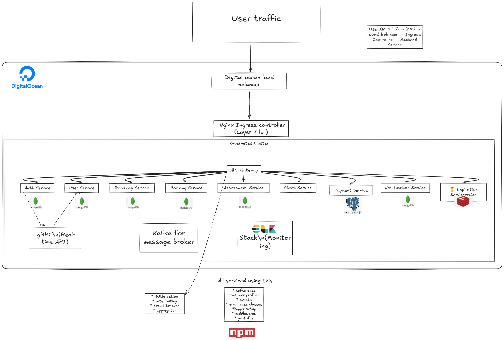

# Roadmap App with Mentor Support

### **Overview**
This project bridges the gap between academic knowledge and industry requirements by providing users with tailored roadmaps for differnet tech skills and access to mentors for 1:1 sessions. Users can explore learning paths, connect with industry-experienced mentors, and even create roadmaps for peer learners. 

Mentors must undergo assessments to validate their skill,It ensures high-quality guidance for users. Notifications and streamlined updates improves the overall user experience.

---
### **Architecture diagram**
 


## **📚 Features**
1. **Explore Roadmaps**: Users can follow pre-defined roadmaps or create custom ones.
2. **Connect with Mentors**: Book 1:1 sessions with mentors based on their skills and availability.
3. **Mentor Application Process**:
   - Mentors must pass skill-based assessments.
   - Admin evaluation ensures quality mentorship.
4. **User-Created Roadmaps**:
   - Users can submit custom roadmaps for review.
   - Admin-reviewed roadmaps maintain quality standards.
5. **Notifications**:
   - Receive updates via in-app notifications and email.
   - Push notifications and efficient fan-out planned for future updates.

---

## **🔧 Technologies Used**

## **Technologies Used**

### **Client-Side**
 
 
 


### **Backend Services**
 
 
 
 
 
 
 
 
 
 


### **Infrastructure and Deployment**
 
 


---

## **🏗️ Project Structure**
### **Services**
1. **Api Gateway**: Entry point of micorservices .
1. **Auth Service**: Handles user authentication and password changes(in feature it change to gateway).
2. **User Service**: Handles user additional data and mentor data.
3. **Roadmap Service**: Manages roadmap creation and exploration.
4. **Assessment Service**: Manages mentor applications, assessments, and events.
5. **Booking Service**: Manages 1:1 session between users and mentors(signaling server also here).
6. **Expiration Service**: Mange expiration in booking reservation and also used to sent booking alert notifcation 30 minutes before the session.
7. **Payment Service**: Mange Payment and also listing webook from stripe .
9. **Notification Service**: Sends updates via email and in-app notifications.

---

## **🎯 Why Build This Project?**
As a computer science student, I faced challenges bridging the gap between academic learning and industry needs. Although colleges provide a foundation, many learners struggle with practical, industry-relevant skills. 

This app addresses these issues by offering:
1. **Tailored Roadmaps**: Guiding users through skill-specific paths (e.g., Backend Engineering).
2. **Mentorship Opportunities**: Helping users connect with experienced mentors for personalized guidance.
3. **Skill Validation**: Allowing mentors to demonstrate their expertise through assessments.

The platform aims to empower learners to achieve their career goals effectively and efficiently.

---

## **🚀 Key Features to Expand**
- Push notifications for real-time updates.
- Efficient fan-out mechanisms for large-scale notifications.
- Enhanced admin dashboards for better roadmap and mentor evaluation.
- Collabration on roadmaps 
---

## **📖 Usage**
### **User Workflow**
1. **Sign Up / Log In**.
2. **Browse Roadmaps**: Select a roadmap to start learning.
3. **Book a Mentor**: Choose a mentor based on skills and availability.
4. **Create Roadmaps**: Submit roadmaps for review (requires admin approval).

### **Mentor Workflow**
1. **Sign Up as Mentor**.
2. **Take Assessment**: Pass skill-based tests.
3. **Host Events**: Create 1:1 or group mentorship sessions.

---

## **📷 Screenshots**

---

## **👨‍💻 Development Setup**

### **Client**
```bash
# Navigate to client directory
cd client

# Install dependencies
pnpm install

# Run the development server
pnpm run dev
